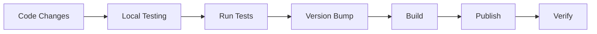

# 🚀 Vibe DevSquad Publishing Guide

> Complete IDE-based publishing workflow for MCP servers and extensions across VS Code, Cursor, and Windsurf

## 📋 Table of Contents

1. [Initial Setup](#initial-setup)
2. [Development Workflow](#development-workflow)
3. [Testing Process](#testing-process)
4. [Publishing Extensions](#publishing-extensions)
5. [Publishing MCP Servers](#publishing-mcp-servers)
6. [Multi-IDE Support](#multi-ide-support)
7. [Automation Scripts](#automation-scripts)
8. [Troubleshooting](#troubleshooting)

---

## 🔧 Initial Setup

### One-Time Configuration (Per Developer)

#### 1. VS Code Marketplace Setup (Works for all VS Code-based IDEs)
```bash
# Install vsce globally
npm install -g @vscode/vsce

# Create publisher account at https://marketplace.visualstudio.com/manage
# Publisher ID: vibe-devsquad

# Get Personal Access Token from https://dev.azure.com
# Scope: Marketplace → Publish

# Login to vsce
vsce login vibe-devsquad
# Enter your PAT when prompted
```

#### 2. NPM Setup (for MCP servers)
```bash
# Login to npm
npm login
# Username: vibe-devsquad
# Email: team@vibe-devsquad.com

# Set npm scope
npm config set @vibe-devsquad:registry https://registry.npmjs.org/
```

#### 3. GitHub Setup
```bash
# Configure git
git config --global user.name "Vibe DevSquad"
git config --global user.email "team@vibe-devsquad.com"

# Add GitHub token for releases
export GITHUB_TOKEN="your-github-token"
```

---

## 🔄 Development Workflow

### Standard Development Process



### IDE Commands Setup

#### VS Code Tasks (tasks.json)
Already configured in each project:
- `Cmd+Shift+P` → "Tasks: Run Task"
- Select from available tasks

#### Custom Keybindings
Add to `keybindings.json`:
```json
[
  {
    "key": "cmd+shift+t",
    "command": "workbench.action.tasks.runTask",
    "args": "Run Tests"
  },
  {
    "key": "cmd+shift+b",
    "command": "workbench.action.tasks.runTask",
    "args": "Build All"
  },
  {
    "key": "cmd+shift+p cmd+shift+p",
    "command": "workbench.action.tasks.runTask",
    "args": "Publish (Auto)"
  }
]
```

---

## 🧪 Testing Process

### Automated Testing Pipeline

#### 1. Unit Tests
```bash
# Run from IDE terminal
npm test

# Or use task: Cmd+Shift+P → "Run Tests"
```

#### 2. Integration Tests
```bash
# Test extension in sandbox
npm run test:integration

# Test MCP server
npm run test:mcp
```

#### 3. Manual Testing Checklist
- [ ] Extension loads without errors
- [ ] All commands work as expected
- [ ] UI elements render correctly
- [ ] WebSocket connections stable
- [ ] MCP server responds to all tools
- [ ] No console errors in dev tools

### Testing Script
```bash
#!/bin/bash
# scripts/test-all.sh

echo "🧪 Running Vibe DevSquad Tests..."

# Unit tests
npm test || exit 1

# Build check
npm run compile || exit 1

# Lint check
npm run lint || exit 1

# Integration tests
npm run test:integration || exit 1

echo "✅ All tests passed!"
```

---

## 📦 Publishing Extensions

### VS Code Extension Publishing (Works for VS Code, Cursor, and Windsurf)

#### Quick Publish Commands
```bash
# From vscode-extension directory
# Bug fixes (1.0.6 → 1.0.7)
npm run release:patch

# New features (1.0.6 → 1.1.0)
npm run release:minor

# Breaking changes (1.0.6 → 2.0.0)
npm run release:major
```

#### Detailed Process

1. **Update Changelog**
   ```markdown
   # Changelog

   ## [1.0.7] - 2024-06-09
   ### Added
   - New quick action buttons
   - Support for all VS Code-based IDEs
   ### Fixed
   - Toolbar icon display issue
   ```

2. **Run Publishing Task**
   - Press `Cmd+Shift+P`
   - Select "Tasks: Run Task"
   - Choose "Publish Extension (Patch/Minor/Major)"

3. **Automated Steps**
   - Version bump in package.json
   - Build production bundle
   - Run tests
   - Package VSIX
   - Upload to marketplace
   - Create git tag
   - Push to GitHub

#### Publishing Script
```bash
#!/bin/bash
# scripts/publish-extension.sh

VERSION_TYPE=${1:-patch}
EXTENSION_NAME="vibe-devsquad-vscode-extension"

echo "🚀 Publishing $EXTENSION_NAME..."
echo "This extension works in VS Code, Cursor, and Windsurf!"
# Pre-publish checks
npm run lint || exit 1
npm test || exit 1

# Build
npm run compile || exit 1

# Update changelog
echo "📝 Update CHANGELOG.md then press Enter"
read

# Publish
vsce publish $VERSION_TYPE

# Git operations
NEW_VERSION=$(node -p "require('./package.json').version")
git add .
git commit -m "Release v$NEW_VERSION"
git tag "v$NEW_VERSION"
git push && git push --tags

echo "✅ Published v$NEW_VERSION"
```

---

## 🖥️ Publishing MCP Servers

### NPM Package Publishing

#### Quick Commands
```bash
# From cursor-mcp-server directory
npm run release:patch
npm run release:minor
npm run release:major
```

#### Detailed MCP Publishing

1. **Update Version**
   ```json
   {
     "name": "@vibe-devsquad/cursor-mcp-server",
     "version": "1.2.0"
   }
   ```

2. **Build & Test**
   ```bash
   npm run build
   npm test
   ```

3. **Publish to NPM**
   ```bash
   npm publish --access public
   ```

4. **Update MCP Registry**
   ```json
   // mcp-registry.json
   {
     "vibe-devsquad": {
       "version": "1.2.0",
       "npm": "@vibe-devsquad/cursor-mcp-server"
     }
   }
   ```

#### MCP Publishing Script
```bash
#!/bin/bash
# scripts/publish-mcp.sh

VERSION_TYPE=${1:-patch}

echo "🖥️ Publishing MCP Server..."

# Update version
npm version $VERSION_TYPE

# Build
npm run build || exit 1

# Test
npm test || exit 1

# Publish to npm
npm publish --access public

# Create GitHub release
VERSION=$(node -p "require('./package.json').version")
gh release create "v$VERSION" \
  --title "MCP Server v$VERSION" \
  --notes "See CHANGELOG.md for details"

echo "✅ MCP Server v$VERSION published"
```

---

## 🌐 Multi-IDE Support

### Single Extension, Multiple IDEs

The VS Code extension works across all VS Code-based IDEs:

```bash
# Same extension package for all
vsce publish

# Users can install in any IDE:
code --install-extension vibe-devsquad.vibe-devsquad-vscode-extension
cursor --install-extension vibe-devsquad.vibe-devsquad-vscode-extension
windsurf --install-extension vibe-devsquad.vibe-devsquad-vscode-extension
```

### No Separate Builds Needed
- ✅ VS Code
- ✅ Cursor  
- ✅ Windsurf

All use the same `.vsix` package from the VS Code marketplace!

---

## 🤖 Automation Scripts

### Master Publishing Script
Create `scripts/publish-all.sh`:

```bash
#!/bin/bash
# Complete publishing automation

PROJECT_TYPE=$1  # extension | mcp | all
VERSION_TYPE=$2  # patch | minor | major

function publish_extension() {
  echo "📦 Publishing Extension..."
  cd vscode-extension
  ./scripts/publish.sh $VERSION_TYPE
  cd ..
}

function publish_mcp() {
  echo "🖥️ Publishing MCP Server..."
  cd cursor-mcp-server
  ./scripts/publish.sh $VERSION_TYPE
  cd ..
}

function update_docs() {
  echo "📚 Updating Documentation..."
  npm run docs:generate
  git add docs/
  git commit -m "docs: Update for v$VERSION"
  git push
}

# Main execution
case $PROJECT_TYPE in
  extension)
    publish_extension
    ;;
  mcp)
    publish_mcp
    ;;
  all)
    publish_extension
    publish_mcp
    update_docs
    ;;
  *)
    echo "Usage: ./publish-all.sh [extension|mcp|all] [patch|minor|major]"
    exit 1
    ;;
esac

echo "🎉 Publishing complete!"
```

### IDE Task Configuration

#### tasks.json (Complete)
```json
{
  "version": "2.0.0",
  "tasks": [
    {
      "label": "Test All",
      "type": "shell",
      "command": "./scripts/test-all.sh",
      "group": "test",
      "presentation": {
        "reveal": "always",
        "panel": "new"
      }
    },
    {
      "label": "Build All",
      "type": "shell",
      "command": "npm run build:all",
      "group": {
        "kind": "build",
        "isDefault": true
      }
    },
    {
      "label": "Publish Extension (Auto)",
      "type": "shell",
      "command": "./scripts/publish-extension.sh",
      "group": "none",
      "presentation": {
        "reveal": "always",
        "panel": "new"
      }
    },
    {
      "label": "Publish MCP (Auto)",
      "type": "shell",
      "command": "./scripts/publish-mcp.sh",
      "group": "none",
      "presentation": {
        "reveal": "always",
        "panel": "new"
      }
    },
    {
      "label": "Publish Everything",
      "type": "shell",
      "command": "./scripts/publish-all.sh all patch",
      "group": "none",
      "presentation": {
        "reveal": "always",
        "panel": "new"
      }
    }
  ]
}
```

---

## 🔍 Troubleshooting

### Common Issues

#### 1. Authentication Failed
```bash
# Re-login to vsce
vsce logout
vsce login vibe-devsquad

# Re-login to npm
npm logout
npm login
```

#### 2. Build Errors
```bash
# Clean and rebuild
rm -rf node_modules dist out
npm install
npm run compile
```

#### 3. Version Conflicts
```bash
# Reset version
npm version --no-git-tag-version 1.0.6
git checkout -- package-lock.json
```

#### 4. Publishing Fails
```bash
# Check marketplace status
curl https://marketplace.visualstudio.com/api/status

# Retry with verbose logging
vsce publish --verbose
```

### Emergency Rollback
```bash
#!/bin/bash
# scripts/rollback.sh

PREVIOUS_VERSION=$1

# Unpublish current version
vsce unpublish vibe-devsquad.vibe-devsquad-vscode-extension

# Checkout previous version
git checkout "v$PREVIOUS_VERSION"

# Rebuild and republish
npm install
npm run compile
vsce publish

echo "⚠️ Rolled back to v$PREVIOUS_VERSION"
```

---

## 📊 Publishing Checklist

Before publishing, ensure:

- [ ] All tests pass (`npm test`)
- [ ] No linting errors (`npm run lint`)
- [ ] Changelog updated
- [ ] Version bumped appropriately
- [ ] README updated if needed
- [ ] Screenshots current
- [ ] API keys not exposed
- [ ] Build succeeds (`npm run compile`)
- [ ] Manual testing completed
- [ ] Git repository clean
- [ ] Previous version backed up

---

## 🎯 Quick Reference

### Most Common Commands

```bash
# Test everything
npm test

# Publish patch update
npm run release

# Publish with specific version
npm run release:minor

# Publish to all platforms
./scripts/publish-all.sh all patch

# Check publishing status
vsce show vibe-devsquad.vibe-devsquad-vscode-extension
```

### IDE Shortcuts
- `Cmd+Shift+T` - Run tests
- `Cmd+Shift+B` - Build project
- `Cmd+Shift+P, P` - Publish (custom)

---

## 📞 Support

For publishing issues:
- Check marketplace status: https://marketplace.visualstudio.com/status
- NPM status: https://status.npmjs.org/
- GitHub Actions: Check workflow runs
- Contact: team@vibe-devsquad.com

---

Last updated: June 9, 2024
